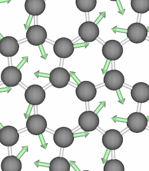
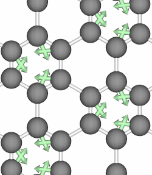
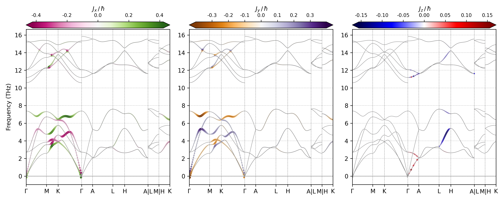

# Phonon Angular Momentum


When the atoms of a crystal move along the path of a circularly polarized phonon
mode, they form closed loops and therefore carry angular momentum.  Below, we
show animations of two typical phonon modes of graphene that involves circular
motions.

      

Phonon angular momentum (PAM) therefore refers to orbital motion of an atom in a
lattice about its *equilibrium position*, and it can be likened to an electron's
orbital about the atomic center. In 2014, Niu et al. first introduced the
concept of phonon angular momentum in their PRL paper.

> "Angular momentum of phonons and the Einstein-de Haas effect", PRL, 112, 085503 (2014)

For detail formulation of the PAM, please refer to this post.

> [Phonon Angular Momentum](http://staff.ustc.edu.cn/~zqj/posts/Phonon-Angular-Momentum/)

The script `pham_band.py` reads the phonon frequencies and phonon polarization
vectors from phonopy output `band.yaml`, then calculate the PAM according to
the formula in the 2014 PRL paper, finally superimpose the phonon angular
momentum on the phonon dispersion.

# Examples

## ZnO

The phonon related data for ZnO was retrieved from [phonopy
examples](https://github.com/phonopy/phonopy/tree/develop/example/ZnO).

1. First, generate the phonon band data using `phonopy`

  ```bash
  cd ZnO
  phonopy --nac band.conf
  ```

2. Secondly, execute the script

  ```bash
  # horizontal 1x3 layout
  pham_band.py --layout h -i band.yaml -t 0
  ```

The resulting image follows:



